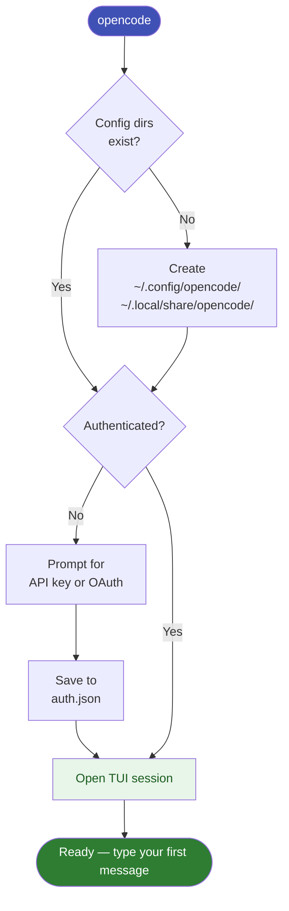

# First Run

## Launch OpenCode

Navigate to any project folder and run:

```powershell
opencode
```

On first launch OpenCode will:

1. Create config directories if they don't exist
2. Prompt you to authenticate (Anthropic API key or OAuth)
3. Open the interactive TUI session



## The Interface

```
┌─────────────────────────────────────┐
│  OpenCode Masterzy                  │
│  Model: anthropic/claude-sonnet-4-6 │
├─────────────────────────────────────┤
│                                     │
│  > Type your message here           │
│                                     │
└─────────────────────────────────────┘
```

| Key | Action |
|-----|--------|
| `Ctrl+P` | Open command palette (list all actions) |
| `Ctrl+C` | Cancel current operation |
| `Ctrl+D` | Exit session |
| `Enter` | Send message |

## Your first prompt

Try asking OpenCode to explain a file:

```
explain this project structure
```

OpenCode will read your working directory and respond.

!!! tip
    Use `Ctrl+P` at any time to see all available commands and shortcuts.
