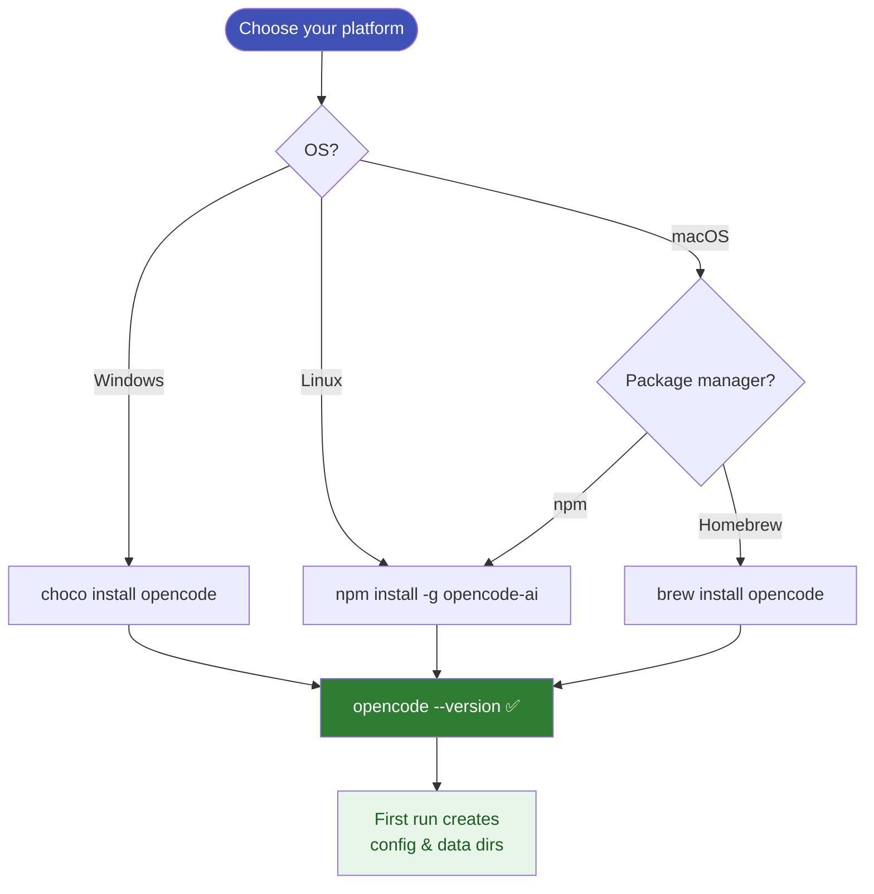

# Installation

OpenCode can be installed on Windows, macOS, and Linux.



## Windows (Chocolatey)

```powershell
choco install opencode
```

Verify:

```powershell
opencode --version
```

The executable lands at:

```
C:\ProgramData\chocolatey\lib\opencode\tools\opencode.exe
C:\ProgramData\chocolatey\bin\opencode.exe  # shim on PATH
```

## macOS / Linux (npm)

```bash
npm install -g opencode-ai
```

## macOS (Homebrew)

```bash
brew install opencode
```

---

## After install

OpenCode creates its config and data directories on first run:

| Purpose | Windows path |
|---------|-------------|
| Config  | `%USERPROFILE%\.config\opencode\` |
| Data    | `%USERPROFILE%\.local\share\opencode\` |

See [Path Structure](../02-path-structure/index.md) for a full breakdown.

!!! note "Version used in this course"
    All examples use OpenCode **v1.18.26**.
