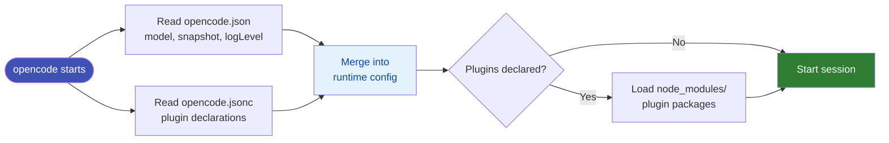

# Config Directory

```
%USERPROFILE%\.config\opencode\
├── opencode.json        ← primary config (model, snapshot, share…)
├── opencode.jsonc       ← secondary config (plugins)
├── package.json         ← npm manifest for plugins
├── package-lock.json
└── node_modules\        ← installed plugin packages
    ├── superpowers\     ← built-in skills package
    ├── @opencode-ai\
    ├── @ai-sdk\
    └── zod\
```

## How config loads at startup



## Two config files

OpenCode merges both files at startup. The split is conventional:

| File | Purpose |
|------|---------|
| `opencode.json` | Core settings: model, snapshot, log level |
| `opencode.jsonc` | Plugin declarations (supports comments) |

## Plugin packages

Plugins are standard npm packages installed into `node_modules\`. The `superpowers` package is the most common — it ships the built-in skills.

```powershell
# Install a plugin
cd %USERPROFILE%\.config\opencode
npm install <package-name>
```

See [Installing Plugins](../05-plugins-mcp/installing-plugins.md) for full details.
