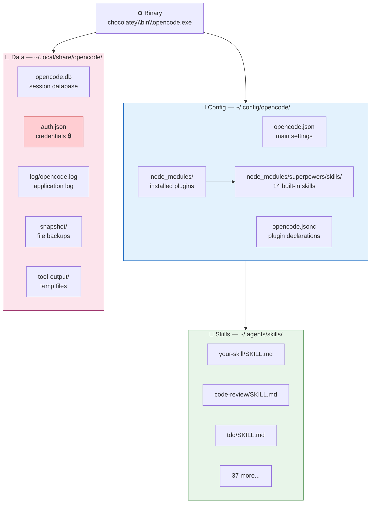

# Path Structure

Understanding where OpenCode stores files is essential for configuration, debugging, and cleanup. OpenCode separates concerns across three root locations.

## Quick map

## Lessons

1. [The Binary](binary.md)
2. [Config Directory](config.md)
3. [Data Directory](data.md)
4. [Skills Locations](skills-locations.md)
