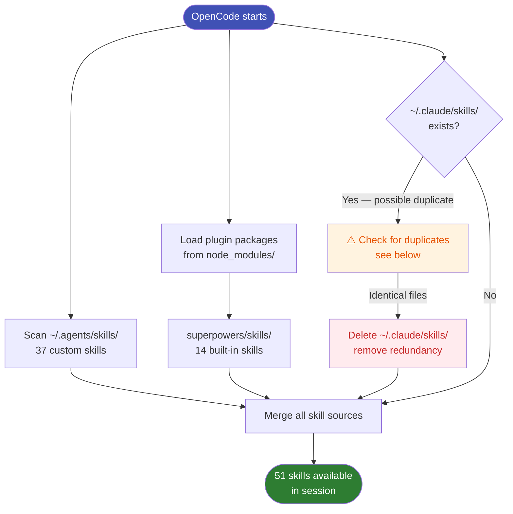

# Skills Locations

Skills are Markdown files that inject specialised workflow instructions into OpenCode. They live in up to three locations:

## The three locations

| Location | Skills | Source |
|----------|--------|--------|
| `%USERPROFILE%\.agents\skills\` | Your custom + third-party skills | Primary user skills dir |
| `%USERPROFILE%\.config\opencode\node_modules\superpowers\skills\` | 14 built-in skills | `superpowers` npm package |
| `%USERPROFILE%\.claude\skills\` | Mirror (if present) | Claude Code compatibility |

## Skills discovery flow



## The redundancy problem

If you installed skills via Claude Code first, you may end up with `~\.claude\skills\` and `~\.agents\skills\` containing identical files. This wastes disk space and causes confusion about which copy is authoritative.

### How to check for duplicates

```powershell
# List both dirs and compare
Get-ChildItem "$env:USERPROFILE\.agents\skills" -Name | Sort-Object
Get-ChildItem "$env:USERPROFILE\.claude\skills" -Name | Sort-Object
```

### How to verify they are identical

```powershell
$agents = "$env:USERPROFILE\.agents\skills"
$claude = "$env:USERPROFILE\.claude\skills"

foreach ($skill in Get-ChildItem $agents -Name) {
    $aFiles = Get-ChildItem "$agents\$skill" -Recurse -File
    foreach ($f in $aFiles) {
        $rel = $f.FullName.Substring("$agents\$skill\".Length)
        $cf  = "$claude\$skill\$rel"
        if (Test-Path $cf) {
            $h1 = (Get-FileHash $f.FullName -Algorithm MD5).Hash
            $h2 = (Get-FileHash $cf -Algorithm MD5).Hash
            if ($h1 -ne $h2) { Write-Host "DIFFERS: $skill\$rel" }
        }
    }
}
```

If no output → files are identical → safe to delete one copy.

### Clean up the duplicate

```powershell
# Keep .agents\skills, remove the .claude\skills mirror
Remove-Item -LiteralPath "$env:USERPROFILE\.claude\skills" -Recurse -Force
```

!!! tip "Single source of truth"
    Keep `~\.agents\skills\` as your primary skills directory. It is the cleaner, non-Claude-specific path.
