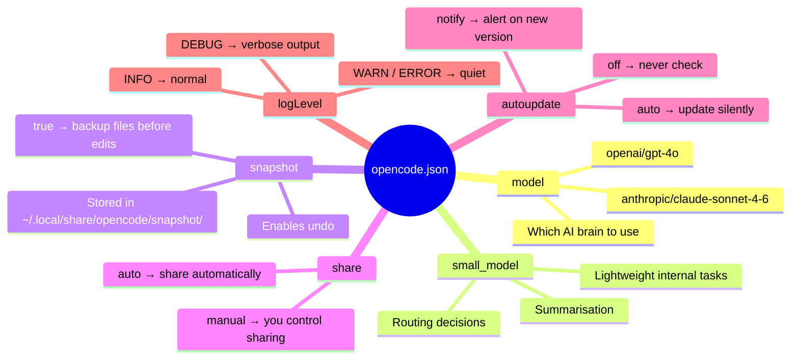

# opencode.json

**Location:** `%USERPROFILE%\.config\opencode\opencode.json`

This is the primary config file. A complete example:

```json
{
  "$schema": "https://opencode.ai/config.json",
  "model": "anthropic/claude-sonnet-4-6",
  "small_model": "anthropic/claude-sonnet-4-6",
  "snapshot": true,
  "share": "manual",
  "autoupdate": "notify",
  "logLevel": "INFO"
}
```

## How each key affects the session



## Keys reference

| Key | Type | Description |
|-----|------|-------------|
| `$schema` | string | Enables IDE autocompletion. Keep this. |
| `model` | string | Default model for all sessions |
| `small_model` | string | Model used for lightweight internal tasks |
| `snapshot` | boolean | Save file snapshots before tool writes (enables undo) |
| `share` | `"manual"` \| `"auto"` | Controls session sharing behaviour |
| `autoupdate` | `"notify"` \| `"auto"` \| `"off"` | How OpenCode handles updates |
| `logLevel` | `"DEBUG"` \| `"INFO"` \| `"WARN"` \| `"ERROR"` | Log verbosity |

## Model string format

Models follow the pattern `provider/model-id`:

```
anthropic/claude-sonnet-4-6
anthropic/claude-opus-4-5
openai/gpt-4o
```

See [Switching Models](models.md) for the full list.

!!! tip "Schema validation"
    Add `"$schema": "https://opencode.ai/config.json"` and your editor will autocomplete valid keys and warn on typos.
