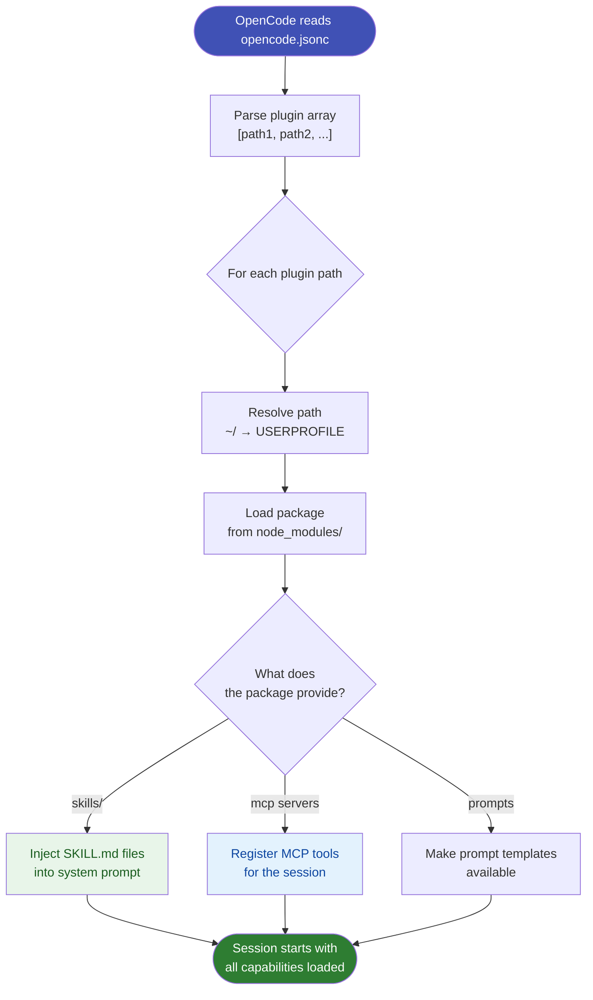

# opencode.jsonc & Plugins

**Location:** `%USERPROFILE%\.config\opencode\opencode.jsonc`

The `.jsonc` file supports comments and is conventionally used for plugin declarations.

## Example

```jsonc
{
  "$schema": "https://opencode.ai/config.json",
  // Load the superpowers skills package
  "plugin": ["~/.config/opencode/node_modules/superpowers"]
}
```

## The `plugin` key

`plugin` is an array of paths to npm packages. Each package can contribute:

- **Skills** — workflow instruction files loaded into the system prompt
- **MCP servers** — tool providers exposed to OpenCode
- **Prompts** — reusable prompt templates

## Installing a plugin package

```powershell
cd "$env:USERPROFILE\.config\opencode"
npm install <package-name>
```

Then register it:

```jsonc
{
  "plugin": [
    "~/.config/opencode/node_modules/superpowers",
    "~/.config/opencode/node_modules/<package-name>"
  ]
}
```

## Plugin loading flow



## Why two config files?

| File | Syntax | Best for |
|------|--------|----------|
| `opencode.json` | Strict JSON | Core settings (model, snapshot…) |
| `opencode.jsonc` | JSON with comments | Plugin lists (comments explain each plugin) |

Both are merged — there is no conflict between them.
