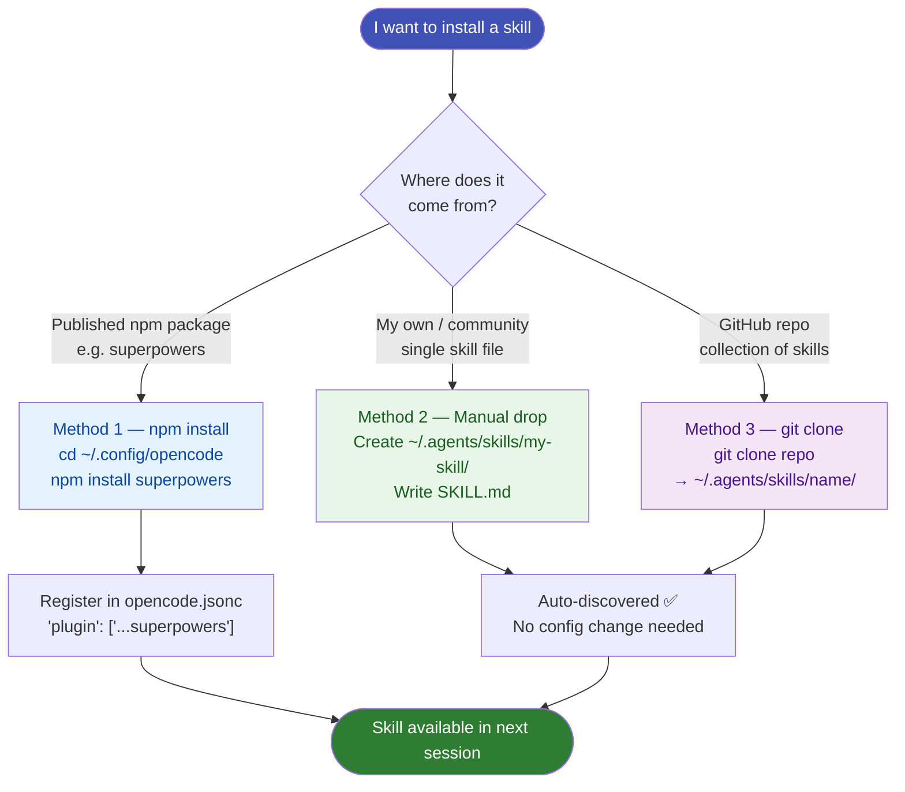

# How to Install Skills

There are three ways to get skills into your OpenCode setup, depending on where they come from.



---

## Method 1 — npm package (recommended for shared skill sets)

The `superpowers` package ships 14 production-ready skills in one install.

```powershell
# Navigate to the OpenCode config directory
cd "$env:USERPROFILE\.config\opencode"

# Install the package
npm install superpowers
```

Register it in `opencode.jsonc`:

```jsonc
{
  "$schema": "https://opencode.ai/config.json",
  "plugin": ["~/.config/opencode/node_modules/superpowers"]
}
```

Skills are immediately available in every new session. No restart required.

---

## Method 2 — Manual file drop (for custom or community skills)

For individual skills (your own or from GitHub):

**Step 1:** Create the skill directory

```powershell
New-Item -ItemType Directory -Path "$env:USERPROFILE\.agents\skills\my-skill"
```

**Step 2:** Create the `SKILL.md` file

```powershell
# Place your SKILL.md in the directory
# See Skill File Structure for what goes inside
```

**Step 3:** Done — OpenCode discovers it automatically

No config change needed. The `~\.agents\skills\` directory is scanned on startup.

---

## Method 3 — Clone a skill repository

For skill collections from GitHub:

```powershell
# Clone directly into your skills directory
git clone https://github.com/<author>/<skills-repo> `
  "$env:USERPROFILE\.agents\skills\<skill-name>"
```

---

## Verify installation

After installing, check what OpenCode sees. Use `Ctrl+P` → **List skills** in a session, or check the directory:

```powershell
# List all custom skills
Get-ChildItem "$env:USERPROFILE\.agents\skills" -Name

# List superpowers skills
Get-ChildItem "$env:USERPROFILE\.config\opencode\node_modules\superpowers\skills" -Name
```

---

## Removing a skill

**npm package skill:** uninstall the package and remove from `opencode.jsonc`

```powershell
cd "$env:USERPROFILE\.config\opencode"
npm uninstall superpowers
```

**Manual skill:** delete the directory

```powershell
Remove-Item -LiteralPath "$env:USERPROFILE\.agents\skills\my-skill" -Recurse -Force
```

---

## Avoiding the duplication trap

If you use both Claude Code and OpenCode, skills may end up duplicated across:

- `~\.agents\skills\` 
- `~\.claude\skills\`

They are identical copies. Remove `~\.claude\skills\` to keep a single source of truth:

```powershell
Remove-Item -LiteralPath "$env:USERPROFILE\.claude\skills" -Recurse -Force
```

See [Skill Locations](skill-locations.md) for full details.
