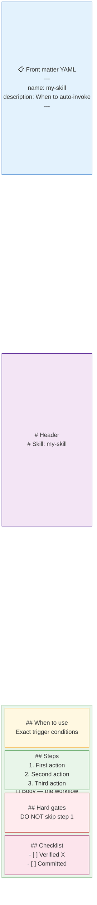

# Skill File Structure

Every skill is a directory containing at least one file: `SKILL.md`. Understanding the structure lets you read, modify, and write skills confidently.

## Directory layout

```
~/.agents/skills/
└── my-skill/
    ├── SKILL.md          ← required: the skill instructions
    ├── reference/        ← optional: supporting reference docs
    │   └── examples.md
    └── scripts/          ← optional: helper scripts the skill runs
        └── setup.sh
```

The skill name is the directory name. OpenCode uses the directory name to match invocations.

---

## SKILL.md anatomy



A well-formed `SKILL.md` has three parts:

### 1. Front matter (YAML)

```yaml
---
name: my-skill
description: One sentence — when should this skill fire?
---
```

The `description` is what appears in skill listings and what the `using-superpowers` router reads to decide when to auto-invoke this skill. **Write it precisely** — vague descriptions lead to wrong auto-invocations.

### 2. Header

```markdown
# Skill: my-skill
```

### 3. Body — the workflow

The body is freeform Markdown but follows a standard pattern:

```markdown
## When to use
Exact trigger conditions. Be specific.

## Steps
1. First action
2. Second action  
3. Third action

## Hard gates (optional)
Things the agent MUST NOT do. Use CAPS for emphasis.
DO NOT write any code before completing step 1.

## Checklist (optional)
- [ ] Verified X
- [ ] Confirmed Y
- [ ] Committed Z
```

---

## A real skill — `tdd`

```yaml
---
name: tdd
description: Test-driven development. Use when the user wants to build 
  features or fix bugs test-first, mentions "red-green-refactor", 
  or wants integration tests.
---
```

```markdown
# Test-Driven Development

TDD is the red → green loop.

## What a good test is
Tests verify behavior through public interfaces, not implementation 
details. A good test reads like a specification.

## The loop
1. Write a failing test
2. Run it — confirm it fails
3. Write minimal code to make it pass
4. Run it — confirm it passes
5. Refactor
6. Commit

## Anti-patterns
- Testing implementation details (breaks on refactor)
- Writing tests after code (defeats the purpose)
- Mocking too much (hides real integration problems)
```

---

## Rules for good skill files

| Rule | Why |
|------|-----|
| One clear purpose per skill | Agents follow focused instructions better |
| Numbered steps | Order matters — agents execute lists sequentially |
| Explicit "when to use" | Powers auto-invocation routing |
| Hard gates in CAPS | Prevents the agent rationalising around them |
| No ambiguity | The agent has no colleague to ask — be explicit |

---

## Skills with supporting files

Some skills reference additional Markdown files for detail:

```markdown
## Steps
1. Read the examples in [reference/examples.md](reference/examples.md)
2. Apply the pattern
```

OpenCode resolves these paths relative to the skill directory.

!!! tip "Read existing skills for inspiration"
    The best way to learn skill authorship is to read the superpowers skills:
    ```
    %USERPROFILE%\.config\opencode\node_modules\superpowers\skills\brainstorming\SKILL.md
    ```
