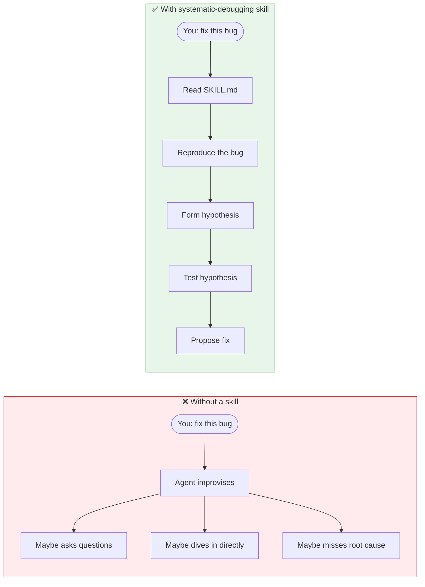
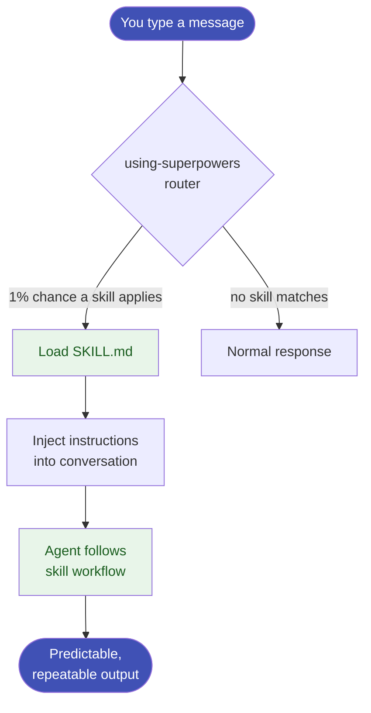

# What is a Skill?

## The problem skills solve

When you ask an AI agent to "review my code" or "fix this bug", it makes up its own process every time. Sometimes it dives straight into fixes. Sometimes it asks questions. Sometimes it misses things. The output is unpredictable.

**Skills solve this by making the process explicit and repeatable.**

## What a skill is

A skill is a Markdown file (`SKILL.md`) that contains:

- **When to invoke it** — trigger conditions, what situations it applies to
- **A step-by-step workflow** — numbered instructions the agent follows every time
- **Guardrails** — what NOT to do, hard gates, self-review checks

When you invoke a skill, OpenCode reads the file and injects its instructions into the conversation. From that point on, the agent follows the skill's workflow — not its own improvised approach.

## A concrete example



The skill enforces the right order of operations.

## Skills vs prompts

| | Prompt | Skill |
|--|--------|-------|
| Lives in | Chat message | `SKILL.md` file on disk |
| Reusable | No | Yes |
| Version controlled | No | Yes |
| Shareable | Copy-paste | Install from package |
| Enforces process | Weakly | Strongly |

## The two skill sources

Your OpenCode setup has skills from two sources:

| Source | Location | Count |
|--------|----------|-------|
| **Superpowers package** | `~/.config/opencode/node_modules/superpowers/skills/` | 14 skills |
| **Custom / community** | `~/.agents/skills/` | 37 skills |

See [Your Installed Skills](your-skills.md) for the complete list.

## How invocation works

Skills are invoked in two ways:

**1. Explicitly — you ask for it:**
```
skill brainstorming
use the tdd skill
```

**2. Automatically — the `using-superpowers` skill routes to the right skill:**

The `using-superpowers` skill (loaded in every session via the superpowers plugin) watches your requests and invokes the matching skill before you even think to ask. If there is a 1% chance a skill applies, it fires.



!!! tip "Skills are not magic"
    A skill is just a Markdown file. You can read it, edit it, or write your own. The power comes from making good process explicit — not from any AI capability.
