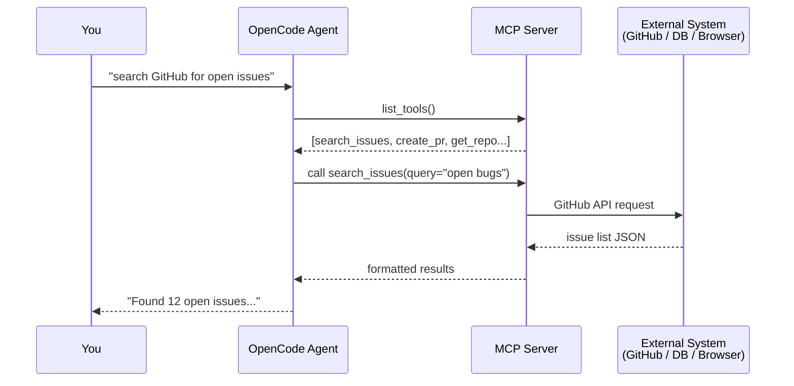

# MCP Servers

MCP (Model Context Protocol) servers expose tools that OpenCode can call — file systems, databases, APIs, browsers, and more.

## What is MCP?

MCP is an open protocol for connecting AI models to external tools. A server declares a set of tools; OpenCode calls them during sessions.



## Add an MCP server

In `opencode.json`:

```json
{
  "mcp": {
    "my-server": {
      "type": "stdio",
      "command": "npx",
      "args": ["-y", "@modelcontextprotocol/server-filesystem", "/path/to/dir"]
    }
  }
}
```

## Server types

| Type | Description |
|------|-------------|
| `stdio` | Runs as a local subprocess, communicates via stdin/stdout |
| `http` | Connects to a remote HTTP server |
| `sse` | Server-Sent Events stream |

## MCP credentials

MCP server auth tokens are stored separately in:

```
%USERPROFILE%\.local\share\opencode\mcp-auth.json
```

Never commit this file.

## Popular MCP servers

| Package | What it provides |
|---------|-----------------|
| `@modelcontextprotocol/server-filesystem` | File system read/write |
| `@modelcontextprotocol/server-github` | GitHub API tools |
| `@modelcontextprotocol/server-brave-search` | Web search |
| `@modelcontextprotocol/server-postgres` | PostgreSQL queries |

!!! tip
    Browse the full MCP server registry at [modelcontextprotocol.io](https://modelcontextprotocol.io).
