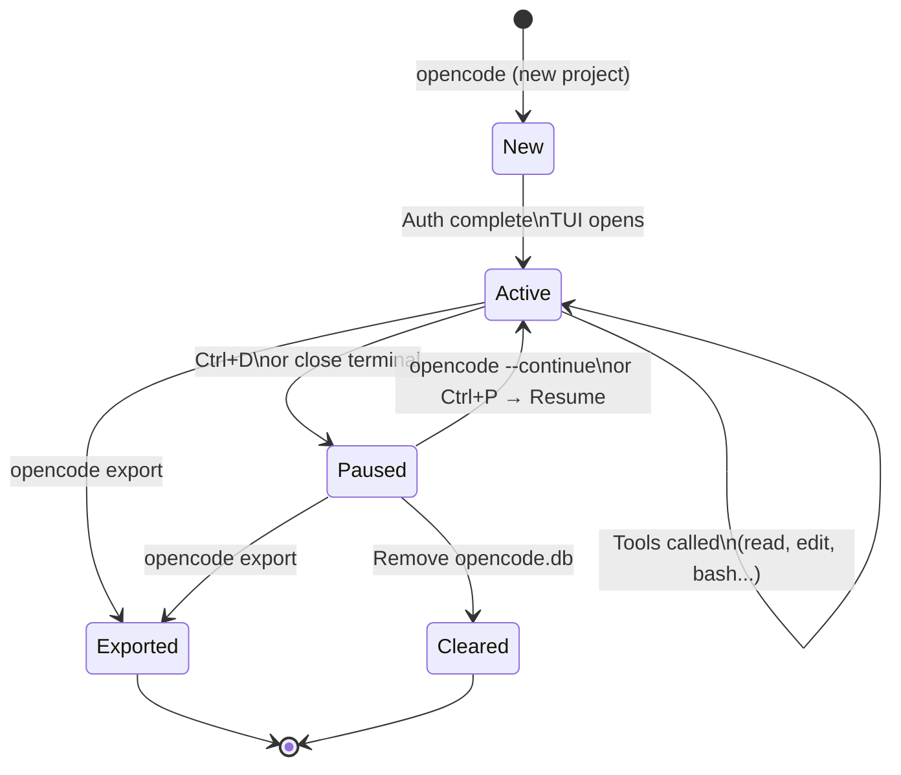

# Sessions

A session is a single conversation with OpenCode. Sessions are persisted to the SQLite database so you can resume them later.

## Session lifecycle



## Session storage

```
%USERPROFILE%\.local\share\opencode\
├── opencode.db          ← all sessions stored here
└── storage\
    └── session_diff\    ← per-session file change diffs
```

## Starting a session

```powershell
# Start in current directory
opencode

# Start in a specific directory
opencode --cwd D:\my-project
```

## Resuming a session

Use `Ctrl+P` → **Resume session** to pick up a previous conversation.

## Session context

OpenCode scopes each session to a working directory. It reads:

- Files you reference explicitly
- Git status and recent commits
- Project config files (package.json, pyproject.toml, etc.)

## Clearing session history

The database grows over time. To clear all history:

```powershell
Remove-Item "$env:USERPROFILE\.local\share\opencode\opencode.db*"
```

!!! warning
    This deletes all session history permanently. Export anything you want to keep first.
