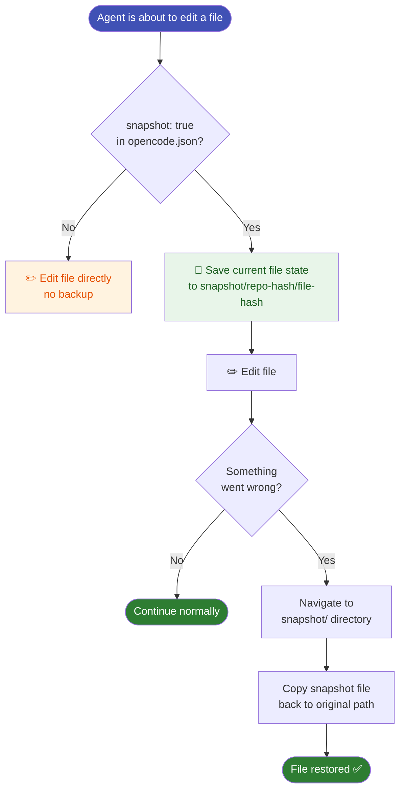

# Snapshots

When `snapshot: true` is set in `opencode.json`, OpenCode saves a copy of each file before modifying it. This gives you a safety net for every tool write.

## Enable snapshots

```json
{
  "snapshot": true
}
```

## How snapshots work



## Where snapshots live

```
%USERPROFILE%\.local\share\opencode\snapshot\
└── <repo-content-hash>\
    └── <file-hash>    ← snapshot of a specific file state
```

Each subdirectory corresponds to a repository (identified by content hash). Each file inside is a snapshot of a file at a point in time.

## Restoring from a snapshot

Snapshots are currently browsed manually — navigate to the snapshot directory, find the file version you want, and copy it back.

!!! tip "Use `share: manual`"
    Combined with `snapshot: true`, `share: "manual"` gives you full control: nothing is shared or overwritten without your explicit action.

## Disk usage

Snapshots accumulate over time. Clean up old ones periodically:

```powershell
# Remove all snapshots (safe — they are just backups)
Remove-Item "$env:USERPROFILE\.local\share\opencode\snapshot\*" -Recurse -Force
```
