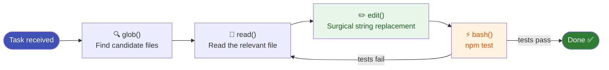

# File Operation Tools

These are the tools OpenCode uses to read and modify your codebase. The agent calls them autonomously — you never type the tool names yourself.

---

## `read` — Read files and directories

Reads a file and returns its contents with line numbers. Also lists directory contents.

**What the agent sees:**
```
1: import express from 'express'
2: 
3: const app = express()
4: app.listen(3000)
```

**Key behaviours:**
- Returns up to 2000 lines by default
- Line numbers are shown as `<line>: <content>` — the agent uses these for precise edits
- Can read images and PDFs
- For directories, lists entries with `/` suffix for subdirs

**Why it matters:** The agent always reads before editing. This prevents it from blindly overwriting files it hasn't seen.

---

## `write` — Create or overwrite files

Writes a complete file to disk. Used for creating new files or wholesale replacements.

**Agent rule:** Must call `read` first on any existing file before writing. Will fail if the file exists and hasn't been read.

**When the agent uses it:**
- Creating a new file from scratch
- Writing config files, documentation

**When it uses `edit` instead:**
- Modifying an existing file — `edit` is always preferred over `write` for changes

---

## `edit` — Surgical string replacement

The most important file tool. Replaces an exact string in a file with a new string. Does **not** rewrite the whole file.

**How it works:**
```
oldString: "const port = 3000"
newString: "const port = process.env.PORT || 3000"
```

OpenCode finds the exact `oldString` in the file and replaces it. If the string appears more than once, you must provide enough surrounding context to make it unique.

**Why surgical editing matters:**

| Whole-file rewrite | Surgical edit |
|-------------------|---------------|
| Sends entire file to model | Sends only the changed region |
| High token cost | Minimal token cost |
| Risk of introducing drift | Changes only what was specified |
| Hard to review in diff | Clean, readable diff |

**`replaceAll` mode:** Pass `replaceAll: true` to rename every occurrence — useful for renaming variables across a file.

---

## `glob` — Find files by pattern

Fast file pattern matching across the entire codebase.

**Patterns the agent uses:**
```
**/*.ts          — all TypeScript files
src/**/*.test.ts — all test files under src/
**/package.json  — all package.json files
```

**Why it's fast:** Uses native glob matching — works on codebases with 100,000+ files without slowing down.

The agent uses `glob` to **orient itself** in an unfamiliar codebase before reading specific files.

---

## Tool interaction pattern

This pattern — **orient → read → edit → verify** — is what makes OpenCode reliable rather than reckless.


