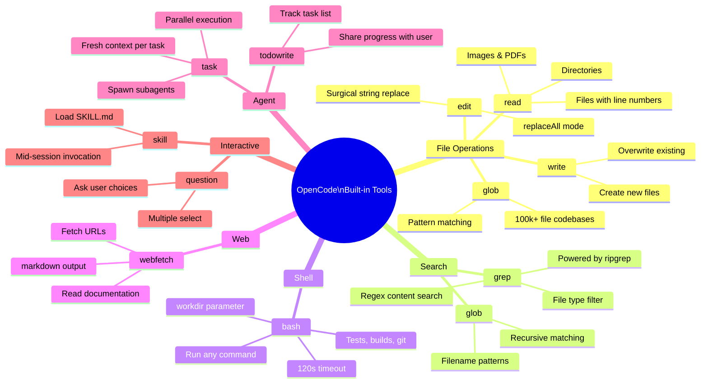

# Built-in Tools

OpenCode ships with a set of purpose-built tools that the AI agent can call during any session. These tools are what separates OpenCode from a chat interface — the agent can **act** on your codebase, not just talk about it.

## What makes a tool different from a skill?

| | Tool | Skill |
|--|------|-------|
| What it is | Code that runs | Markdown that guides |
| What it does | Reads files, runs commands, edits code | Tells the agent *how* to think and work |
| Invoked by | The agent autonomously | You or the router |
| Examples | `bash`, `read`, `edit`, `glob` | `brainstorming`, `tdd`, `code-review` |

Tools are the agent's **hands**. Skills are its **discipline**.

## Tools overview

## Tool categories

| Category | Tools | Purpose |
|----------|-------|---------|
| [File Operations](file-tools.md) | `read`, `write`, `edit`, `glob` | Read and modify your codebase |
| [Search](search-tools.md) | `grep`, `glob` | Find files and content at scale |
| [Shell](shell-tools.md) | `bash` | Run any terminal command |
| Web | `webfetch` | Fetch URLs and read docs |
| Agent | `task`, `todowrite` | Spawn subagents, track tasks |
| Interactive | `question`, `skill` | Ask you questions, invoke skills |

## Why this makes OpenCode the best agent

Most AI coding tools give the model a general-purpose code-execution environment and hope for the best. OpenCode's tools are **purpose-designed for software engineering tasks**:

- **Surgical file editing** — `edit` does exact string replacement, not whole-file rewrites. Fewer tokens, fewer mistakes.
- **Fast search at any scale** — `grep` and `glob` use ripgrep under the hood. Works on codebases with 100k+ files.
- **Parallel subagents** — `task` spawns independent agents that work simultaneously, then reports back. 4 tasks in parallel = 4x faster.
- **Structured task tracking** — `todowrite` gives you and the agent shared visibility into progress. Nothing gets forgotten.
- **Direct skill invocation** — `skill` loads workflow instructions mid-session without leaving the conversation.
