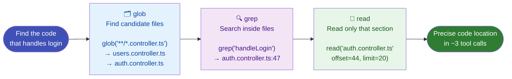

# Search Tools

Search tools let the agent find exactly what it needs in any codebase — instantly, regardless of size.

---

## `grep` — Search file contents by regex

Searches all file contents using regular expressions. Returns file paths and line numbers with matching lines.

**What the agent searches for:**
```
log.*Error          — error logging patterns
function\s+\w+      — all function definitions
import.*from 'react' — all React imports
class\s+Controller  — controller classes
```

**Include filter:** Narrows search to specific file types:
```
pattern: "useState"
include: "*.tsx"    → only search React component files
```

**Why regex matters:** The agent can find patterns it doesn't know the exact name of. Searching `handle.*Error` finds `handleError`, `handleNetworkError`, `handleApiError` — all at once.

**Under the hood:** Uses **ripgrep** (`rg`) — the fastest code search tool available. Searches a 1 million line codebase in milliseconds.

---

## `glob` — Find files by name pattern

Matches file paths using glob patterns. Returns a list of matching paths.

**Common patterns:**

| Pattern | Finds |
|---------|-------|
| `**/*.ts` | All TypeScript files |
| `src/**/*.test.ts` | All test files under `src/` |
| `**/package.json` | All package manifests |
| `**/*.{ts,tsx}` | TypeScript and TSX files |
| `!**/node_modules/**` | Exclude node_modules |

---

## How the agent combines them

`glob` and `grep` work together in a three-step precision search:



The agent uses them in sequence:

**Step 1 — glob** to find candidate files:
```
glob("**/*.controller.ts")
→ ["src/users.controller.ts", "src/auth.controller.ts"]
```

**Step 2 — grep** to find the specific code:
```
grep("handleLogin", include="*.ts")
→ src/auth.controller.ts:47:  async handleLogin(req, res) {
```

**Step 3 — read** the precise location:
```
read("src/auth.controller.ts", offset=44, limit=20)
```

This three-step pattern means the agent **never reads more than it needs** — keeping token usage low and responses fast.

---

## Why this beats naive file reading

A naive agent reads every file it might need. OpenCode's agent searches first:

| Naive approach | OpenCode approach |
|---------------|------------------|
| Read 50 files to find the bug | grep → find it in 1 file |
| High token cost | Minimal token cost |
| Slow on large codebases | Instant on any size |
| May miss the location entirely | Precise regex match |
