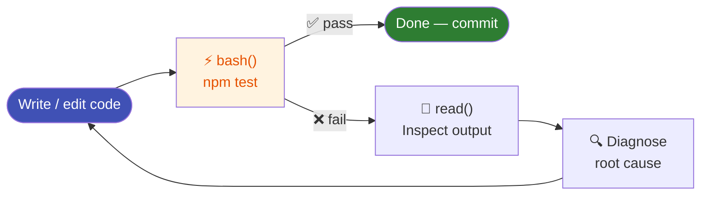

# Shell Tool

The shell tool is OpenCode's most powerful tool — and its most consequential. It lets the agent run any terminal command on your machine.

---

## `bash` — Run terminal commands

Executes a command in your shell and returns stdout + stderr.

**What the agent runs:**

```bash
# Run tests
npm test
pytest tests/

# Build the project
npm run build
cargo build

# Git operations
git status
git diff HEAD~1
git log --oneline -10

# Install dependencies
pip install -r requirements.txt
npm install

# Query the filesystem
find . -name "*.log" -mtime +7
```

**Platform:** On Windows this is PowerShell 5.1. On macOS/Linux it is bash.

---

## Why the shell tool makes OpenCode an agent

Without a shell tool, an AI is a **text generator**. With it, OpenCode is an **agent** — it can:

| Capability | Example |
|-----------|---------|
| Verify its own work | Run tests after every change |
| Install dependencies | `npm install` before using a package |
| Inspect live state | `git status` to see what changed |
| Execute builds | Confirm the build passes before declaring done |
| Run migrations | Apply database changes |
| Interact with CLIs | `gh pr create`, `docker build` |

**The verification loop:**



This loop is why OpenCode doesn't just write code — it writes code that works.

---

## Safety constraints

The shell tool runs with your permissions. OpenCode applies several guardrails:

- **Permission prompts** — destructive commands prompt for approval by default
- **Timeout** — commands time out at 120 seconds (configurable per call)
- **No directory changes** — the agent uses the `workdir` parameter instead of `cd`, preventing working-directory drift between commands
- **Skill guardrails** — skills like `git-guardrails-claude-code` can block dangerous operations (force push, `reset --hard`, `branch -D`) before they execute

!!! warning "The `--auto` flag"
    Running `opencode --auto` approves all permission prompts automatically. Only use this in trusted, sandboxed environments. Never on production systems.

---

## Chaining commands safely

The agent uses PowerShell conditional chaining, not `&&`:

```powershell
# Good — second command only runs if first succeeds
npm install; if ($?) { npm test }

# Good — independent commands run sequentially
git add .; git commit -m "feat: add login"
```

---

## Working directory

The agent always specifies `workdir` explicitly rather than changing directory:

```
bash("npm test", workdir="D:/my-project/backend")
```

This means each tool call is stateless with respect to directory — no risk of running `rm -rf` in the wrong place.
